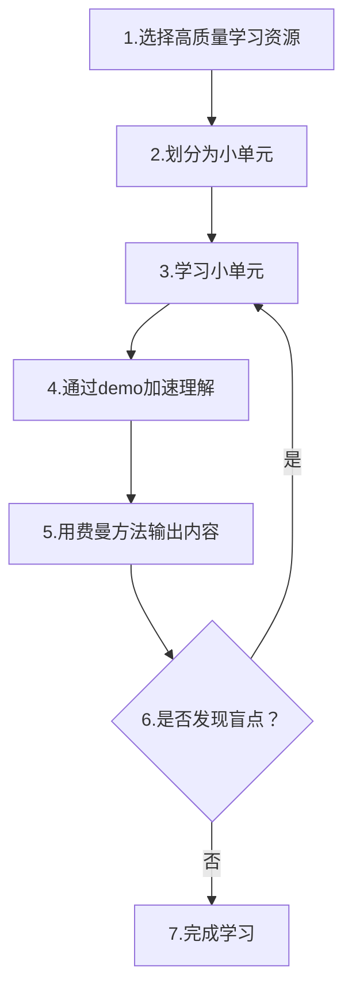

---
{"dg-publish":true,"permalink":"/费曼学习法/","dgPassFrontmatter":true}
---

## 1. 费曼学习法

```
费曼学习法
1.是什么(概念)？
	是一种学习方法。从老师的角度讲问题，不断反思，总结出更简洁易懂的回答。
2.有什么？
	高效学习，掌握-学习对象。
3.怎么用？
	核心做法：explain it
	步骤：
    	A.base：get a concept
    	B.start
    		1.select a concept
    		2.teach to toher
    		3.think answer
    		4.teach agian
		继续2.3.4知道完美效果

利用费曼学习法，自己要做的就是：
0.通过学习---获取一个概念
1.选择一个概念
2.教会其他人（通过回答：1是什么？2.有什么用？3怎么用？）
3.反思优化答案
4.继续教的动作。
2,3,4重复。达到完美效果，结束重复。
		

其他补充：

学习类型有哪两种？
每种类型的具体例子有哪些?
具体例子学习效果强弱的排序？

被动学习
    lecture
    reading
    audiovisaul
    demonstration
主动学习
    discussion
    practice doing
    teach other  
学习效果从上到下递增。

```
## 2. 提问模版

2024/5/11 19:04

```
1.xxx是什么？（概念）
2.xxx有什么用？(作用，解决什么问题，相比其他方案，有什么优缺点？)
3.xxx怎么用？（使用。包括:语法、用法、使用场景... ）
4.xxx原理是什么？(原理)
```

## 3. 学习-相关辅助工具
- 结构化【xmind】
	- 作用：知识简化、结构化
- 文字【obsidian ~~mybase~~】
	- 作用：更详细的文字描述；图、代码、详细描述的组合。
- 代码【github | gitee】
	- 作用：记录学习历史；提供代码例子
- 复习【anki】
	- 作用：复习相关
- 图【drawio】
	- 作用：自画图，提供图片支持

## 4. 知识点-高效记忆

```
具体的方：
1.经常复习
    结合anki
    结合xmind
2.尝试教会别人
    学习法
3..实践+联系知识点

需要“悟”的方法：
1.建立扎实基础
2.创建创造性学习
    尝试利用自己的方式，去解决问题，理解知识点。

```

## 5. 补充-demo的重要性

学习中，可以根据**demo**来**快速理解**内容。

难点：合适的demo哪里找。

目前已知：
- [[进行中/w3schools\|w3schools]] 中的教程有**大量的Demo**。

## 6. 我的学习流程




1. **优先选择高质量资源：**
   - **节省整理资料的时间**，直接从**权威**和**条理清晰**的教程中学习。
   - 如：官方文档、优质视频课程（如 B 站、Coursera）或 w3schools。

2. **结合示例和 Demo 加速理解：**
   - 边学习边查看相关代码示例或案例，帮助更快掌握抽象概念。
   - 如：用代码验证异常处理、算法运行等知识点。

3. **快速迭代：**
   - 每次输出和教学时，聚焦小模块内容，快速发现盲点并优化。
---

4. **输出形式多样化：** 用费曼方法的深入输出包括（内容更有弹性）
	1. xmind结构图
	2. obsidan文档
	3. code demo
	4. anki问答
	5. drawio图（可能）

1. **逻辑更清晰：** 强调“输出内容”是一个**递进的环节**，覆盖**应用和总结**。

---
**输出和深入输出区别**

（mine: 先用熟悉，后原理）

**1. 用费曼方法输出内容**

- **定义：**  
    将所学的知识用通俗易懂的方式表达出来，目的是检测和巩固当前的学习成果。
- **场景：**  
    通常在学习的中期或针对某个小模块时使用，用来检验自己对知识点的理解程度。
- **形式：**
    - 向他人解释概念（面对面或书面）。
    - 写出简化版笔记、回答问题或制作演示。
- **目标：**  
    通过输出找出盲点，反馈回学习环节，完成循环优化。

---

**2. 用费曼方法进行深入输出**

- **定义：**  
    在完成基础理解后，通过更复杂的应用场景、跨学科联系或实际问题解决，进一步深化对知识的掌握。
- **场景：**  
    通常在学习的后期，或对完整知识体系进行深入探究时使用。
- **形式：**
    - 实际项目中的应用（如用代码实现一个功能）。
    - 将知识与实践结合，产出高质量内容（如技术博客、思维导图、工具总结）。
    - 通过跨学科应用（如用学到的技术解决其他领域的问题）。
- **目标：**  
    将知识内化为长期记忆，通过实际应用和总结巩固。

**两者的主要区别：**

| **对比项**   | **用费曼方法输出内容**     | **用费曼方法进行深入输出**     |
| ------------ | -------------------------- | ------------------------------ |
| **深度**     | 浅层理解，侧重概念掌握     | 深层探索，注重综合应用         |
| **应用场景** | 检验学习成果，找到盲点     | 实践应用，生成知识总结或工具化 |
| **目标**     | 反馈学习环节，完善模块内容 | 内化知识，建立长期记忆和系统   |
| **时间节点** | 学习中期（模块学习后）     | 学习后期（整体优化时）         |

---

**总结：**

- **输出内容** 是一个“检测工具”，是初步验证学习成果的阶段。
- **深入输出** 是“知识升华”，通过实践和跨学科联系，巩固知识体系并形成自己的理解框架。

这两个环节是递进关系，可以根据学习进度和需求选择适用的方式。